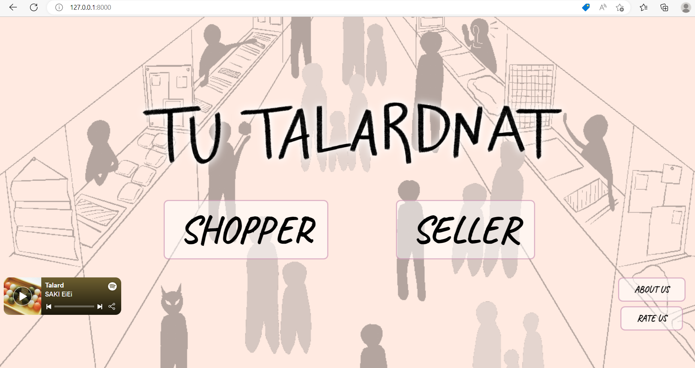
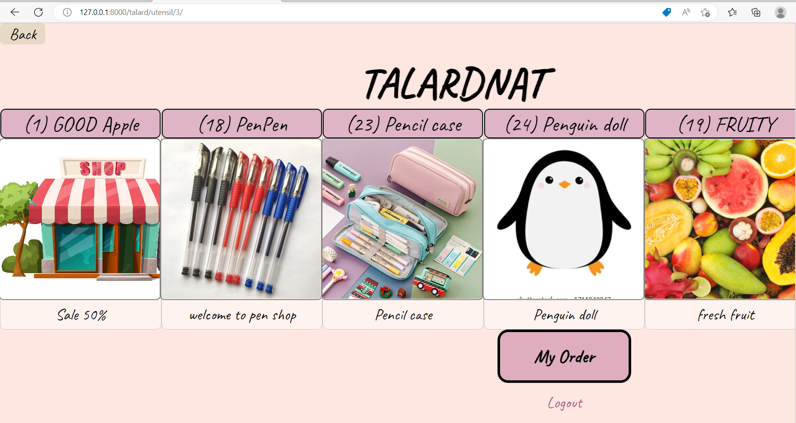
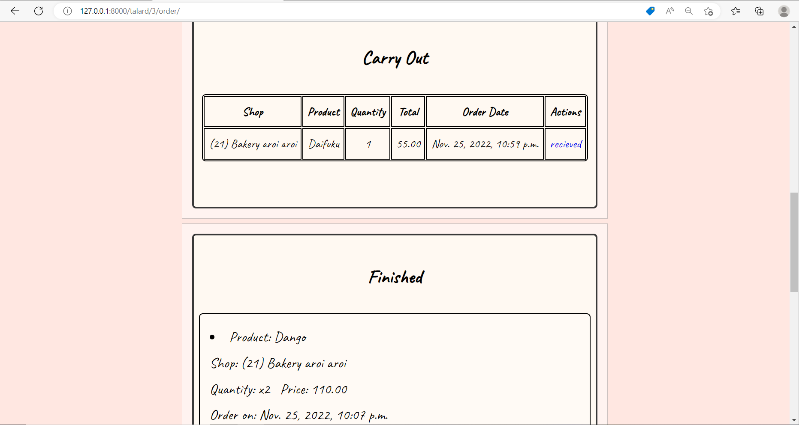
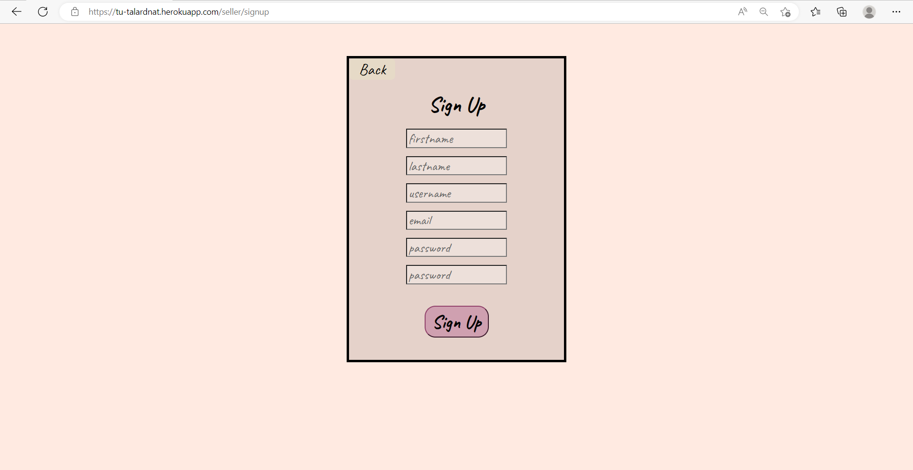

# TU-TALARDNAT

Video How to use our website<br>
[](https://www.youtube.com/watch?v=DJVMMIAhhWY)

Link to heroku<br>
[](https://tu-talardnat.herokuapp.com/)


-------
## Installation

1. Clone GitHub repository.

    **RUN:**
    ```console
    git clone https://github.com/6310682619/cn331-Talardnat.git
    ```

2. Create a **virtual environment**.

    Linux/MacOS:

   **RUN:**

   ```console
   python3 -m venv venv
   ```

   Windows:

   **RUN:**

   ```console
   python -m venv venv
   ```

3. Activate virtual environment.

    Linux/MacOS:

   **RUN:**

   ```console
   . ./venv/bin/activate
   ```

   Windows:

   **RUN:**

   ```console
   . ./venv/Scripts/activate
   ```

4. Install requirements for this project.

   **RUN:**

    ```console
    python install -r requirements.txt
    ```
5. Change to directory that contain file **manage.py**

    **RUN:**

    ```console
    cd /Talardnat
    ```

6. Run server.

    **RUN:**

    ```console
    python manage.py runserver
    ```

7. Open project using browser.

   Open URL: [**`https://127.0.0.1:8000`**](https://127.0.0.1:8000)


## Usage
### **USER PART**

[](Talardnat/images/2022-11-26.png)
เมื่อเข้าหน้าเว็บไซต์จะปรากฏหน้าหลักของตลาด ซึ่งจะมีให้เลือกว่าจะเป็น ผู้ซื้อ (Shopper) หรือผู้ขาย (Seller) และมีปุ่ม rate us และ about us ที่มุมล่างขวา

[](Talardnat/images/about.png)
หน้า About Us จะแสดงข้อมูลของผู้พัฒนาเว็บไซต์ รวมถึง link ไปยัง GitHub repository และ Pivotal Tracker

[](Talardnat/images/rate.png)
หน้า Rate Us ผู้ใช้ทุกคนสามารถประเมิณความพึงพอใจในการใช้งานเว็บไซต์ได้ โดยจะต้องทำการ login ก่อน


#### CUSTOMER
1. เมื่อเข้ามาที่หน้า shopper จะปรากฏหน้า login ซึ่ง user สามารถเข้าได้ด้วยการใส่ username และ password
[](Talardnat/images/cuslog.png)
หาก user ยังไม่มีบัญชี สามารถกดไปที่ Sign Up as Customer เพื่อสร้างบัญชีได้
[](Talardnat/images/cussign.png)

2. หลังจาก login สำเร็จจะเข้าไปที่หน้า Your Profile : Customer ที่จะแสดงข้อมูลของเจ้าของบัญชี
[](Talardnat/images/cuspro.png)

3. กดปุ่ม SHOP จะเข้าสู่หน้า catagory ซึ่งจะมีให้เลือกระหว่างจะไปโซน food(ขายอาหาร) หรือ utensil(ขายของใช้) โดยที่ตรงมุมล่างซ้ายมีปุ่มที่สามารถไปหน้า Home, Rate us, About us, My order และ log out
[](Talardnat/images/category.png)

4. หากกดไปที่ปุ่ม food จะเข้าไปที่หน้า talard หน้านั้นจะเรียงร้านค้า ซึ่งส่วนหน้าจะเป็นร้านขายอาหารแล้วส่วนท้ายจะเป็นร้านขายของใช้ 
[](Talardnat/images/food.png)
หากกดไปที่ปุ่ม utensil ร้านขายของใช้จะเรียงอยู่ที่ส่วนหน้า แล้วมีร้านขายอาหารอยู่ในส่วนท้าย
โดยด้านล่างจะมีปุ่ม My order เพื่อเข้าไปหน้า order ของฉันทันที
[](Talardnat/images/uten.png)

5. เมื่อกดเข้าไปในร้าน จะเจอกับหน้าร้าน และ Product ของร้าน 
[](Talardnat/images/shop.png)
เราสามารถเลือกสินค้าที่ต้องการ ใส่จำนวนแล้วกดปุ่ม add เพื่อสร้าง order
[](Talardnat/images/shop2.png)
 
6. ที่ด้านล่างจะเจอกับ review ของร้านค้าร้านนี้ ซึ่งเราสามารถอ่าน review จากผู้ใช้คนอื่น หรือเขียน review ได้

โดยผู้ใช้จะไม่สามารถเขียน review ได้หากไม่เคยสั่งซื้อสินค้าของร้านนี้

 แต่หากผู้ใช้ได้ทำการสั่งซื้อสินค้าแล้ว ผู้ใช้สามารถเขียน review ได้ 


7. ลูกค้าสามารถเข้าไปดูสินค้าที่เลือกในหน้า My order ในส่วนของ Shopping cart คือตารางของสินค้าที่เราหยิบใส่ตะกร้า แต่ยังไม่ได้ทำการจ่ายเงิน

8. หากต้องการชำระค่าสินค้าให้กดที่ปุ่ม Check Out แล้วจะมีหน้าต่างเด้งขึ้นมาให้ใส่ข้อมูลของบัตรที่จะใช้ชำระเงิน

หลังจากชำระเงินเรียบร้อย สินค้าของเราจะเข้าไปอยู่ในตาราง Carry out ซึ่งเป็นตารางของสินค้าที่ชำระเงินแล้วและอยู่ในระหว่างจัดส่ง โดยเมื่อลูกค้าได้รับสินค้าแล้วให้ทำการกด recieved

9. จากนั้นสินค้าที่ยืนยันว่าได้รับแล้วจะไปอยู่ที่ Finished เพื่อแสดงว่ากระบวนการซื้อสินค้านี้เสร็จสิ้นแล้ว


#### SELLER

1. เมื่อเข้ามาที่หน้า seller จะปรากฏหน้า login ซึ่ง user สามารถเข้าได้ด้วยการใส่ username และ password

หาก user ยังไม่มีบัญชี สามารถกดไปที่ Sign Up as Seller เพื่อสร้างบัญชีได้


2. หากใส่ password และ user ในหน้า login ถูกต้อง จะปรากฎหน้า Profile ซึ่งจะแสดงข้อมูลของ Seller จาก Profile เราสามารถ เข้าไปที่ Myshop ได้


3. ที่หน้า Myshop จะแสดง My shop list ซึ่งเป็นร้านค้าต่างๆของเรา สามารถเลือกกดร้านค้าที่เราจะเข้าไปจัดการได้

หรือหากอยากเพิ่มร้านค้าตัวเองก็สามารถกดเพิ่มร้านค้าที่ ADD SHOP ด้านล่างสุดได้


4. เมื่อเข้ามาที่หน้าร้านค้าที่เลือก (MYSHOP) ก็จะสามารถจัดการกับร้านค้าของเราได้ โดยมีปุ่มให้เลือก 4 ปุ่ม คือ product, edit, review, add queue

 จะมีรายการ order จากที่ลูกค้ากดเลือกซื้อแสดงอยู่ด้านล่างของหน้า โดยมี
Aleready paid คือรายการสินค้าที่จ่ายเงินซื้อเรียบร้อนแล้ว
New Order คือ รายการสินค้าที่ถูกใส่ไว้ในตระกร้าแล้ว แต่ยังไม่ได้จ่ายเงิน
Recieved Order คือรายการสินค้าที่ลูกค้ากดว่าได้รับแล้ว


5. เมื่อเข้าไปที่หน้า My product จากหน้า My shop แล้ว เราก็จะสามารถ ดูรายการสินค้า แก้ไขรายละเอียดสินค้า ลบสินค้า หรือ เพิ่มสินค้าได้


6. เมื่อเข้าไปที่หน้า Edit detail จากหน้า My shop แล้ว เราก็จะสามารถแก้ไขรายละเอียดของร้านค้าต่างๆได้ ทั้ง Name, Category, In interact, Ex interact, Shop image, Payment


7. เมื่อเข้าไปที่หน้า My Review จากหน้า My shop เราก็จะสามารถเห็นดาว และรีวิวจากลูกค้าที่มารีวิวร้านของเราได้


8. เมื่อเข้าไปที่หน้า Add Queue จากหน้า My shop เราจะสามารถกด Add Queue ร้านเพื่อไปขายจริงได้ โดยจะแบ่งเป็นรอบตามวันที่ที่กำหนด หากอยากยกเลิก Queue ก็สามารถกด Cancle Queue ที่ด้านบนสุดได้


### **ADMIN PART**
เมื่อเข้าหน้าเว็บไซต์จะปรากฏหน้าหลักของตลาด ต้องไปที่ URL เพื่อเพิ่ม /admin ต่อท้าย URL แล้วก็จะสามารถเข้าหน้า log in ของ admin ได้ ซึ่งต้องใช้ username และ password ของ admin ในการเข้าหน้า admin
1. ผู้ที่เป็น admin สามารถดูได้ว่าใครเป็น user ของเว็บบ้าง โดยกดเข้าไปดูที่ Users รวมถึงสามารถเพิ่มและลบ user ได้
2. ผู้ที่เป็น admin สามารถดูได้ว่าใครเป็น user ฝั่ง customer บ้าง โดยการกดไปที่ Profile และสามารเพิ่มและลบ user ที่เป็น customer ได้ รวมถึงสามารถแก้ไขข้อมูลของ user แต่ละคนได้ด้วย
3. ผู้ที่เป็น admin สามารถดูได้ว่า user ที่เป็น customer สั่งสินค้าอะไรบ้าง จากร้านค้าไหนโดยไปดูที่ My order
4. ผู้ที่เป็น admin สามารถดูได้ว่า user ที่เป็น seller ขายสินค้าอะไรบ้างในร้านไหนโดยไปดูที่ Products
5. ผู้ที่เป็น admin สามารถจัดการ round ต่าง ๆ ได้ โดยกดไปดูที่ Rounds ซึ่ง admin สามารถเพิ่มลด round ได้ รวมถึงแก้ไขร้านค้าที่ต่อ queue ใน round นั้น ๆ ได้
6. ผู้ที่เป็น admin สามารถดูได้ว่ามีร้านค้าอะไรในเว็บบ้างและร้านค้านั้นเป็นของ user ฝั่ง seller คนไหน โดยกดไปดูที่ Shop_details
7. ผู้ที่เป็น admin สามารถดูได้ว่าใครเป็น user ฝั่ง seller บ้าง โดยการกดไปที่ Seller_details และสามารเพิ่มและลบ user ที่เป็น seller ได้ รวมถึงสามารถแก้ไขข้อมูลของ user แต่ละคนได้ด้วย
8. ผู้ที่เป็น admin สามารถดูได้ว่ามี user คนไหนมาให้ Rate เว็บไซต์บ้าง และเขาให้ Rate ไว้ว่าอย่างไร โดยกดไปดูที่ Rate uss
9. ผู้ที่เป็น admin สามารถดูได้ว่ามี user ที่เป็น customer คนไหนเขียน review ให้ร้านค้าไหนบ้าง และเขียนไว้ว่าอย่างไร โดยการกดเข้าไปดูที่ Reviews

Link to Pivotal Tracker<br>
[<svg xmlns="http://www.w3.org/2000/svg" xmlns:xlink="http://www.w3.org/1999/xlink" width="159" height="20"><linearGradient id="b" x2="0" y2="100%"><stop offset="0" stop-color="#bbb" stop-opacity=".1"/><stop offset="1" stop-opacity=".1"/></linearGradient><clipPath id="a"><rect width="159" height="20" rx="3" fill="#fff"/></clipPath><g clip-path="url(#a)"><path fill="#555" d="M0 0h106v20H0z"/><path fill="#007ec6" d="M106 0h53v20h-53z"/><path fill="url(#b)" d="M0 0h159v20H0z"/></g><g fill="#fff" text-anchor="middle" font-family="DejaVu Sans,Verdana,Geneva,sans-serif" font-size="11"><image x="5" y="3" width="14" height="14" xlink:href="data:image/png;base64,iVBORw0KGgoAAAANSUhEUgAAAA4AAAAOCAYAAAAfSC3RAAAAAXNSR0IArs4c6QAAAAlwSFlzAAALEwAACxMBAJqcGAAABCJpVFh0WE1MOmNvbS5hZG9iZS54bXAAAAAAADx4OnhtcG1ldGEgeG1sbnM6eD0iYWRvYmU6bnM6bWV0YS8iIHg6eG1wdGs9IlhNUCBDb3JlIDUuNC4wIj4KICAgPHJkZjpSREYgeG1sbnM6cmRmPSJodHRwOi8vd3d3LnczLm9yZy8xOTk5LzAyLzIyLXJkZi1zeW50YXgtbnMjIj4KICAgICAgPHJkZjpEZXNjcmlwdGlvbiByZGY6YWJvdXQ9IiIKICAgICAgICAgICAgeG1sbnM6dGlmZj0iaHR0cDovL25zLmFkb2JlLmNvbS90aWZmLzEuMC8iCiAgICAgICAgICAgIHhtbG5zOmV4aWY9Imh0dHA6Ly9ucy5hZG9iZS5jb20vZXhpZi8xLjAvIgogICAgICAgICAgICB4bWxuczpkYz0iaHR0cDovL3B1cmwub3JnL2RjL2VsZW1lbnRzLzEuMS8iCiAgICAgICAgICAgIHhtbG5zOnhtcD0iaHR0cDovL25zLmFkb2JlLmNvbS94YXAvMS4wLyI+CiAgICAgICAgIDx0aWZmOlJlc29sdXRpb25Vbml0PjI8L3RpZmY6UmVzb2x1dGlvblVuaXQ+CiAgICAgICAgIDx0aWZmOkNvbXByZXNzaW9uPjU8L3RpZmY6Q29tcHJlc3Npb24+CiAgICAgICAgIDx0aWZmOlhSZXNvbHV0aW9uPjcyPC90aWZmOlhSZXNvbHV0aW9uPgogICAgICAgICA8dGlmZjpPcmllbnRhdGlvbj4xPC90aWZmOk9yaWVudGF0aW9uPgogICAgICAgICA8dGlmZjpZUmVzb2x1dGlvbj43MjwvdGlmZjpZUmVzb2x1dGlvbj4KICAgICAgICAgPGV4aWY6UGl4ZWxYRGltZW5zaW9uPjE0PC9leGlmOlBpeGVsWERpbWVuc2lvbj4KICAgICAgICAgPGV4aWY6Q29sb3JTcGFjZT4xPC9leGlmOkNvbG9yU3BhY2U+CiAgICAgICAgIDxleGlmOlBpeGVsWURpbWVuc2lvbj4xNDwvZXhpZjpQaXhlbFlEaW1lbnNpb24+CiAgICAgICAgIDxkYzpzdWJqZWN0PgogICAgICAgICAgICA8cmRmOlNlcS8+CiAgICAgICAgIDwvZGM6c3ViamVjdD4KICAgICAgICAgPHhtcDpNb2RpZnlEYXRlPjIwMTY6MTI6MjggMTc6MTI6OTM8L3htcDpNb2RpZnlEYXRlPgogICAgICAgICA8eG1wOkNyZWF0b3JUb29sPlBpeGVsbWF0b3IgMy42PC94bXA6Q3JlYXRvclRvb2w+CiAgICAgIDwvcmRmOkRlc2NyaXB0aW9uPgogICA8L3JkZjpSREY+CjwveDp4bXBtZXRhPgpyIB8IAAABZ0lEQVQoFYXSSyuEURjA8fcdRExNLoOJUuQe2RGlrFj5Dixs3DZ8EFtF1mzYsJJSFpKFGptZyLWUXHJLbq//X8wC5dSv886Z8zznnOecMPjRoigqZ6geSUQ4RyYMw2v6bAu/vwgo5LsdlbjDFfKRQAFOkCbBM33wGfgV1M3vPOzjFr3YxCNSMOkNtg2OEWRwGwxaZ/CYfgorGMcrcrCFYjQhiKEUFcigi0T99Kd4wghGsYNhpFHDnHguHw24xwPW4FmPsIoiTKAEnvkQzagy0OpZOQOdbFVfMIk4lrGEBY7xzmrOS7lVW4xBKzmEN1hJq2dVL2GyeYLcjVcUuOIF4gxapGn0YReLsFCNsA51cAcGHxhoUXpQDQddYRYzaMUYvHyvqAzGnAWuhE4MwJVr4dgcbFbWeQkMwvv89QDMtge376V3YANeVwuyD8BzfTYyuU2z+eSsnJMsVBJ/Pzn+yDYSWMF/H/kHgnmYVVG1U9gAAAAASUVORK5CYII="/><text x="61.5" y="15" fill="#010101" fill-opacity=".3">pivotal tracker</text><text x="61.5" y="14">pivotal tracker</text><text x="131.5" y="15" fill="#010101" fill-opacity=".3">finished</text><text x="131.5" y="14">finished</text></g></svg>](https://www.pivotaltracker.com/n/projects/2606902)

-----
## TEAM MEMBERS

- 6310611014 - ชวันรัตน์ ทรัพย์เบญจภาคิน
- 6310682601 - มุนินทร์ วุฒิพงศ์วรกิจ
- 6310682619 - เขมิกา วีรกุลวัฒนา
- 6310682650 - รัญชนา ศุภเสวต
